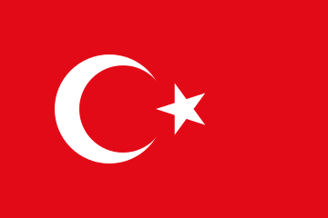

# Türk Bayrağı
[Resmi tüzüğe uygun](https://www.mevzuat.gov.tr/MevzuatMetin/2.5.859034.pdf) Türk bayrağı çizimidir.

Internette dolaşan SVG bayraklardan farklı olarak burada `<rect>`, `<circle>`, `<polygon>` kullanılarak çizim yapılmıştır.
Bu sayede tüzüğe uygun olup olmadığını parametreleri kontrol ederek teyit edebilirsiniz.

Piyasada dolaşan SVG bayraklar fotoğraftan (*raster image*) devşirmedir, `<path>` kullanarak çizim yapar.
Bunlarda tüzüğe uygunluğu kontrol etmek pratik olarak mümkün değildir.
