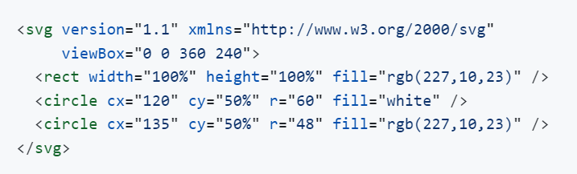
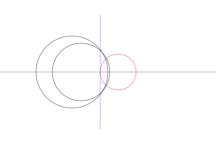
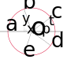

# Türk Bayrağı
[Resmi tüzüğe](https://www.mevzuat.gov.tr/MevzuatMetin/2.5.859034.pdf) uygun Türk bayrağının
Javascript ve SVG kullanılarak çizimidir.


## Ayın çizilmesi
Tüzüğün 4. maddesinde teknik detaylar belirtilmiştir. Buna göre ayı çizmek çok kolaydır.
`en=240` için çizim (uçkur hariç) aşağıda gösterilmiştir.

|  |  |
| --- | --- |
| boy = 360 | bayrak eninin 1,5 katıdır |
| ay dış çember merkezinin x koordinatı = 120 | uçkurun iç kenarından bayrak eninin yarısı uzaklıktadır |
| ay dış çember merkezinin y koordinatı = 120 veya 50% | eksen üzerindedir |
| ay dış çemberinin yarıçapı = 60 | çapı bayrak eninin yarısıdır |
| ay iç çember merkezinin x koordinatı = 120+15 = 135 | dış çember merkezinden bayrak eninin 0,0625 katı uzaklıktadır |
| ay iç çember merkezinin y koordinatı = 120 veya 50% | eksen üzerindedir |
| ay iç çemberinin yarıçapı = 48 | çapı bayrak eninin onda dördüdür |

## Yıldız çemberi
Tüzükte yıldız çember merkezi tarif edilmemiştir, ancak
yıldız çemberinin uçkur yönünde ekseni kesen noktası tanımlanmıştır.
Bu nokta ayın iki ucundan geçtiği farzedilen düşey doğrunun ekseni kestiği yerdir,
ve iç çemberin uçkur yönünde ekseni kesen noktasından bayrak eninin üçte biri uzaklıktadır.
Bu noktanın üzerine yıldız çemberi yarıçapı kadar daha eklersek yıldız merkezini bulmuş oluruz.
Bu hesapla bulunan yıldız çemberi aşağıda kırmızıyla gösterilmiştir.

<table role="table">
<tr><td colspan="2">


</td></tr>
    <tr>
        <td>Ayın iki ucundan geçen doğrunun ekseni kesen noktasının x koordinatı = 135-48+80 = 167</td>
        <td>iç çemberin uçkur yönünde ekseni kesen noktasından bayrak eninin üçte biri uzaklıktadır</td>
    </tr>
    <tr>
        <td>Yıldız çember merkezinin x koordinatı = 167+30 = 197</td>
        <td>Yıldız çemberinin çapı bayrak eninin dörtte biridir</td>
    </tr>
</table>


***Dikkat:*** Yukarıdaki şemada ay uçlarından geçmesi gereken düşey çizginin tam olarak uçlarda olmayıp
biraz içeride kaldığı görülmektedir.
Yani bu çizginin sağ tarafında aya ait hiçbir parça görülmemesi gerekirken parçalar bu şemada görülmektedir
ve çizilecek yıldızın ay içine biraz girmesine sebep olmaktadır.
Bu, SVG motorunun bir hatası olabilir veya başka nedenlerle oluşabilir, ancak sonuçta hatadır.
Bu çizginin **uçkur genişliğinin yarısı** kadar daha sağa alınması bu hatanın giderilmesini sağlamaktadır.
Uçkur genişliği bayrak eninin otuzda biri olduğuna göre eklenecek miktar 240/60 = 4 olur.
Yıldız çember merkezinin x koordinatı 197+4 = 201 olur.
Bu durum aşağıdaki şekillerde net olarak görülmektedir.


        


## Yıldızın çizilmesi



Yukarıdaki şekilde yıldız çemberi ve bu çember üzerinde olması gereken 5 adet yıldız köşesi gösterilmektedir.
a köşesi ile çember merkezinin (*O*) koordinatları ve çember yarıçapı (*r*) bilinmektedir.
Kalan köşelerin koordinatlarını temel trigonometri bilgilerini kullanarak bulabiliriz.

b ve c köşelerinden eksene birer dik çekerek hipotenüsleri çember yapıçapı olan iki dik üçgen elde edelim.
Yıldız köşelerinin çemberi 5 eşit parçaya ayırdığı bilindiğine göre, a-b yayını gören merkez açı `360/5 = 72` derece olur.
`cos(72) = v/r` eşitliğinden `v = cos(72)*r` olur. `sin(72) = s/r` eşitliğinden `s = sin(72)*r` olur.

c ile eksen arasında kalan yayı gören merkez açı `180-(72+72) = 36` derece olur.
`cos(36) = p/r` eşitliğinden `p = cos(36)*r` olur. `sin(36) = t/r` eşitliğinden `t = sin(36)*r` olur.

a köşesi eksen üzerinde olduğundan e köşesi b'ye, d köşesi c'ye simetriktir.
Yukarıda bulduğumuz büyüklükleri bu köşeler için de kullanabiliriz.
a köşesinden başlayıp saat yönünde birer köşe atlayarak `<polygon>` ile yıldız çizilir.

## Çözüm
➡️ [Tarayıcıda göster](https://alperali.github.io/bayrak/bayrak.html)

```html
<!doctype html>
<html>
<head>
  <meta charset="utf-8">
  <meta name="viewport" content="width=device-width, initial-scale=1">
  <title>Türk Bayrağı</title>
</head>
<body>
  <svg version="1.1" xmlns="http://www.w3.org/2000/svg">
    <rect width="100%" height="100%" />
  </svg>
  <script>
    const celm = (e) => document.createElementNS('http://www.w3.org/2000/svg', e);
    const en = 240, kırmızı = "rgb(227,10,23)";
    const s = document.querySelector('svg');
    const boy = en * 1.5,
          ay_dış_çember_x = en/2,
          ay_dış_çember_y = en/2,
          ay_dış_çember_yçap = en/4,
          ay_iç_çember_x = ay_dış_çember_x + en/16,   // 0.0625 == 1/16
          ay_iç_çember_y = en/2,
          ay_iç_çember_yçap = en/5,
          yıldız_yçap = en/8,
          // aşağıdaki en/60 == uçkur genişliğinin yarısı
          yıldız_çember_x = ay_iç_çember_x - ay_iç_çember_yçap + en/3 + en/60 + yıldız_yçap,

          // yıldız köşelerinin koordinatları, saat yönünde
          köşeler = [
            {x: yıldız_çember_x - yıldız_yçap, y: en/2},  // ekseni kesen yıldız köşesi
            {x: yıldız_çember_x - Math.cos(2*Math.PI/5)*yıldız_yçap, y: en/2 - Math.sin(2*Math.PI/5)*yıldız_yçap},
            {x: yıldız_çember_x + Math.cos(Math.PI/5)*yıldız_yçap, y: en/2 - Math.sin(Math.PI/5)*yıldız_yçap},
            {x: yıldız_çember_x + Math.cos(Math.PI/5)*yıldız_yçap, y: en/2 + Math.sin(Math.PI/5)*yıldız_yçap},
            {x: yıldız_çember_x - Math.cos(2*Math.PI/5)*yıldız_yçap, y: en/2 + Math.sin(2*Math.PI/5)*yıldız_yçap}
          ];

    s.setAttribute('viewBox', `0 0 ${boy} ${en}`);  // tüzükte kısa kenara en denildiği için ters yazıldı
    document.querySelector('rect').setAttribute('fill', `${kırmızı}`);

    // ayın çizimi
    const dış = celm('circle');
    dış.setAttribute('cx', `${ay_dış_çember_x}`);
    dış.setAttribute('cy', `${ay_dış_çember_y}`);
    dış.setAttribute('r', `${ay_dış_çember_yçap}`);
    dış.setAttribute('fill', 'white');
    s.appendChild(dış);
    const iç = celm('circle');
    iç.setAttribute('cx', `${ay_iç_çember_x}`);
    iç.setAttribute('cy', `${ay_iç_çember_y}`);
    iç.setAttribute('r', `${ay_iç_çember_yçap}`);
    iç.setAttribute('fill', `${kırmızı}`);
    s.appendChild(iç);

    // yıldızın çizimi
    const yldz = celm('polygon');
    yldz.setAttribute('points',
      `${köşeler[0].x},${köşeler[0].y}`.concat(
      ` ${köşeler[2].x},${köşeler[2].y}`,
      ` ${köşeler[4].x},${köşeler[4].y}`,
      ` ${köşeler[1].x},${köşeler[1].y}`,
      ` ${köşeler[3].x},${köşeler[3].y}`)
    );
    yldz.setAttribute('fill', 'white');
    s.appendChild(yldz);
  </script>
</body>
</html>
```

## Sonuç
➡️ [Tarayıcıda göster](https://alperali.github.io/bayrak/tr.svg)

```html
<svg version="1.1" xmlns="http://www.w3.org/2000/svg" viewBox="0 0 360 240">
  <rect width="100%" height="100%" fill="rgb(227,10,23)"></rect>
  <circle cx="120" cy="120" r="60" fill="white"></circle>
  <circle cx="135" cy="120" r="48" fill="rgb(227,10,23)"></circle>
  <polygon
    points="171,120 225.27050983124843,102.3664424312258 191.72949016875157,148.5316954888546 191.72949016875157,91.46830451114539 225.27050983124843,137.6335575687742"
    fill="white"></polygon>
</svg>
```
