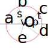

# Türk Bayrağı
[Resmi tüzüğe](https://www.mevzuat.gov.tr/MevzuatMetin/2.5.859034.pdf) uygun Türk bayrağı çizimidir.


Internette dolaşan SVG bayraklardan farklı olarak burada `<rect>`, `<circle>`, `<polygon>` kullanılarak çizim yapılmıştır.
Bu sayede tüzüğe uygun olup olmadığını parametreleri kontrol ederek teyit edebilirsiniz.

Piyasada dolaşan SVG bayraklar fotoğraftan (*raster image*) devşirmedir, `<path>` kullanarak çizim yapar.
Bunlarda tüzüğe uygunluğu kontrol etmek pratik olarak mümkün değildir.

## Ayın çizilmesi
Tüzüğün 4. maddesinde teknik detaylar belirtilmiştir. Buna göre ayı çizmek çok kolaydır.
`en=240` için çizim (uçkur hariç) aşağıda gösterilmiştir.

<table role="table">
<tr><td>
    
```svg
<svg version="1.1" xmlns="http://www.w3.org/2000/svg"
     viewBox="0 0 360 240">
  <rect width="100%" height="100%" fill="rgb(227,10,23)" />
  <circle cx="120" cy="50%" r="60" fill="white" />
  <circle cx="135" cy="50%" r="48" fill="rgb(227,10,23)" />
</svg>
```
</td><td>


</td></tr>
  <tr>
    <td>boy = 360</td><td>bayrak eninin 1,5 katıdır</td>
  </tr>
  <tr>
    <td>ay dış çember merkezinin x koordinatı = 120</td><td>uçkurun iç kenarından bayrak eninin yarısı uzaklıktadır</td>
  </tr>
  <tr>
    <td>ay dış çember merkezinin y koordinatı = 120 veya 50%</td><td>eksen üzerindedir</td>
  </tr>
  <tr>
    <td>ay dış çemberinin yarıçapı = 60</td><td>çapı bayrak eninin yarısıdır</td>
  </tr>
  <tr>
    <td>ay iç çember merkezinin x koordinatı = 120+15 = 135</td><td>dış çember merkezinden bayrak eninin 0,0625 katı uzaklıktadır</td>
  </tr>
  <tr>
    <td>ay iç çember merkezinin y koordinatı = 120 veya 50%</td><td>eksen üzerindedir</td>
  </tr>
  <tr>
    <td>ay iç çemberinin yarıçapı = 48</td><td>çapı bayrak eninin onda dördüdür</td>
  </tr>
</table>

## Yıldız çemberi
Tüzükte yıldız çember merkezi tarif edilmemiştir, ancak yıldız çemberinin uçkur yönünde ekseni kesen noktası tanımlanmıştır.
Bu nokta ayın iki ucundan geçtiği farzedilen düşey doğrunun ekseni kestiği yerdir,
ve iç çemberin uçkur yönünde ekseni kesen noktasından bayrak eninin üçte biri uzaklıktadır.
Bu noktanın üzerine yıldız çemberi yarıçapı kadar daha eklersek yıldız merkezini bulmuş oluruz.
Bu hesapla bulunan yıldız çemberi aşağıda kırmızıyla gösterilmiştir.

<table role="table">
<tr><td colspan="2">


</td></tr>
    <tr>
        <td>Ayın iki ucundan geçen doğrunun ekseni kesen noktasının x koordinatı = 135-48+80 = 167</td>
        <td>iç çemberin uçkur yönünde ekseni kesen noktasından bayrak eninin üçte biri uzaklıktadır</td>
    </tr>
    <tr>
        <td>Yıldız çember merkezinin x koordinatı = 167+30 = 197</td>
        <td>Yıldız çemberinin çapı bayrak eninin dörtte biridir</td>
    </tr>
</table>


***Dikkat:*** Yukarıdaki şemada ay uçlarından geçmesi gereken düşey çizginin tam olarak uçlarda olmayıp biraz içeride kaldığı görülmektedir.
Yani bu çizginin sağ tarafında aya ait hiçbir parça görülmemesi gerekirken parçalar bu şemada görülmektedir ve çizilecek yıldızın ay içine
biraz girmesine sebep olmaktadır. Bu, SVG motorunun bir hatası olabilir veya başka nedenlerle oluşabilir, ancak sonuçta hatadır.
Bu çizginin **uçkur genişliğinin yarısı** kadar daha sağa alınması bu hatanın giderilmesini sağlamaktadır.
Uçkur genişliği bayrak eninin otuzda biri olduğuna göre eklenecek miktar 240/60 = 4 olur. Yıldız çember merkezinin x koordinatı 201 olur.
Bu durum aşağıdaki şekillerde net olarak görülmektedir.


        


## Yıldızın çizilmesi



Yukarıdaki şekilde yıldız çemberi ve bu çember üzerinde olması gereken 5 adet yıldız köşesi gösterilmektedir (a,b,c,d,e).
Şu ana kadar a köşesi ile çember merkezinin (*O*) koordinatları ve çember yarıçapı (*r*) bilinmektedir.
Kalan köşelerin koordinatlarını temel trigonometri bilgilerini kullanarak bulabiliriz.

b ve c köşelerinden eksene birer dik çekerek hipotenüsleri çember yapıçapı olan iki dik üçgen elde edelim.
Yıldız köşelerinin çemberi 5 eşit parçaya ayırdığı bilindiğine göre, a-b yayını gören merkez açı `360/5 = 72` derece olur.
`cos(72) = v/r` eşitliğinden `v = cos(72)*r` olur. `sin(72) = s/r` eşitliğinden `s = sin(72)*r` olur.

c ile eksen arasında kalan yayı gören merkez açı `180-(72+72) = 36` derece olur.
`cos(36) = p/r` eşitliğinden `p = cos(36)*r` olur. `sin(36) = t/r` eşitliğinden `t = sin(36)*r` olur.

a köşesi eksen üzerinde olduğundan e köşesi b'ye, d köşesi c'ye simetriktir.
Yukarıda bulduğumuz büyüklüleri bu köşeler için de kullanabiliriz.

Bu hesaplamalar sonucu köşelerin koordinatları aşağıdadır:
```
a = 171,120
b = 191.72949016875,91.46830451114
c = 225.27050983124,102.36644243122
d = 225.27050983124,137.63355756877
e = 191.72949016875,148.53169548885
```

a köşesinden başlayıp saat yönünde birer köşe atlayarak `<polygon>` ile yıldız çizilir.

```svg
<svg version="1.1" xmlns="http://www.w3.org/2000/svg"
     viewBox="0 0 360 240">

  <rect width="100%" height="100%" fill="rgb(227,10,23)" />

  <circle cx="120"  cy="50%" r="60" fill="white" />
  <circle cx="135"  cy="50%" r="48" fill="rgb(227,10,23)" />
  
  <polygon points="171,120 225.27050983124,102.36644243122 191.72949016875,148.53169548885 191.72949016875,91.46830451114 225.27050983124,137.63355756877"
     fill="white" />
	 
</svg>
```
